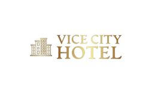
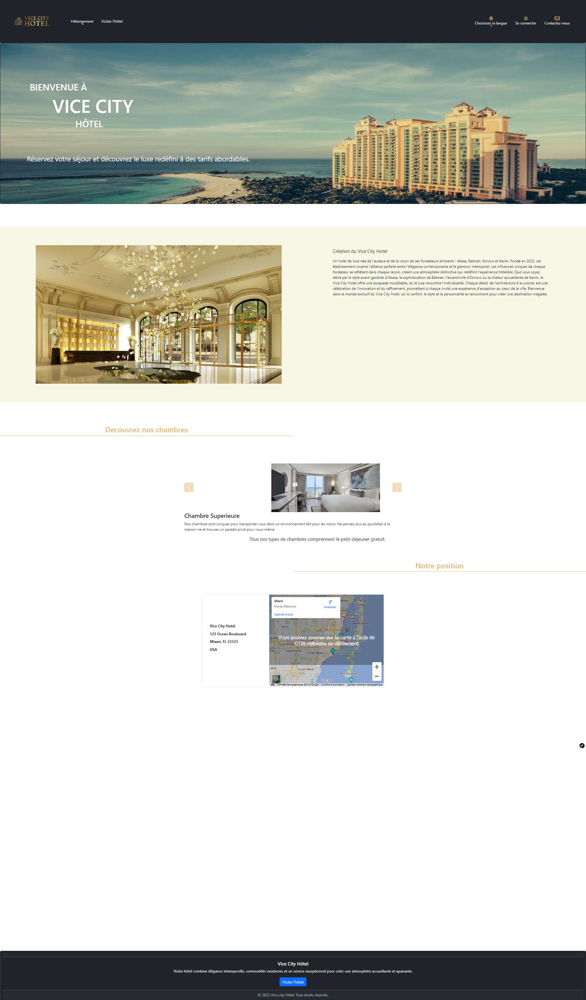
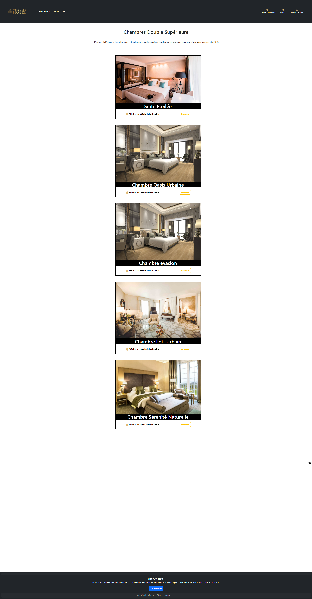

# Vice City Hotel

# Gestion d'Hôtel - Application

## Description

L'application de gestion d'hôtel est un système complet pour la gestion efficace d'un hôtel ou d'une chaîne d'hôtels. Cette application offre une gamme de fonctionnalités pour aider à automatiser les opérations de l'hôtel, de la réservation des chambres à la gestion des factures.

## Fonctionnalités principales

- **Gestion des réservations :** Permet de gérer les réservations des clients, d'afficher les détails des réservations et de les mettre à jour au besoin.

- **Gestion des chambres :** Facilite la gestion des types de chambres, leur disponibilité et leur tarification.

- **Check-in et Check-out :** Enregistrement et départ des clients en toute simplicité avec génération automatique de factures.

- **Facturation :** Génère automatiquement des factures pour les clients avec des détails précis sur les frais d'hébergement et les services complémentaires.

- **Gestion des employés :** Permet de gérer les comptes et les autorisations des employés.

- **Suivi des revenus :** Affiche des rapports sur les revenus, les taux d'occupation et d'autres indicateurs clés de performance.

- **Intégration de paiement :** Prend en charge les paiements en ligne sécurisés pour les réservations et les services.

## Captures d'écran

# Navbar
[g-navbar id="navbar3" name="navbar3" centering=none brand_text="Brand"]
    [g-navbar-menu name=menu00 alignment="center" submenu="internal,components"][/g-navbar-menu]
    [g-navbar-menu name=menu01 icon_type="fontawesome" alignment="right" attributes="class: my-class,rel:my-rel"]
        [g-link url="https://framasphere.org" icon_type="fontawesome" icon="asterisk"][/g-link]
        [g-link url="https://framapiaf.org" icon="retweet"][/g-link]
        [g-link url="https://framagit.org" icon="git"][/g-link]
    [/g-navbar-menu]
[/g-navbar]

